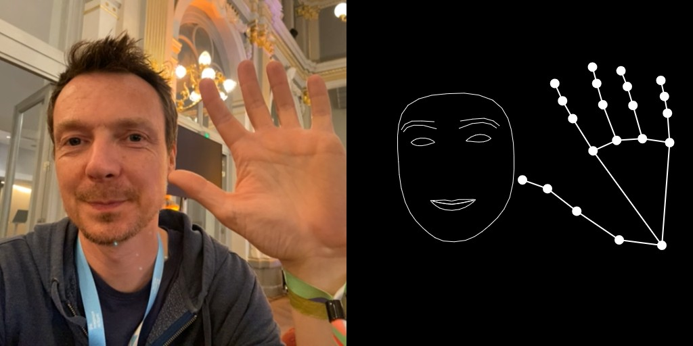
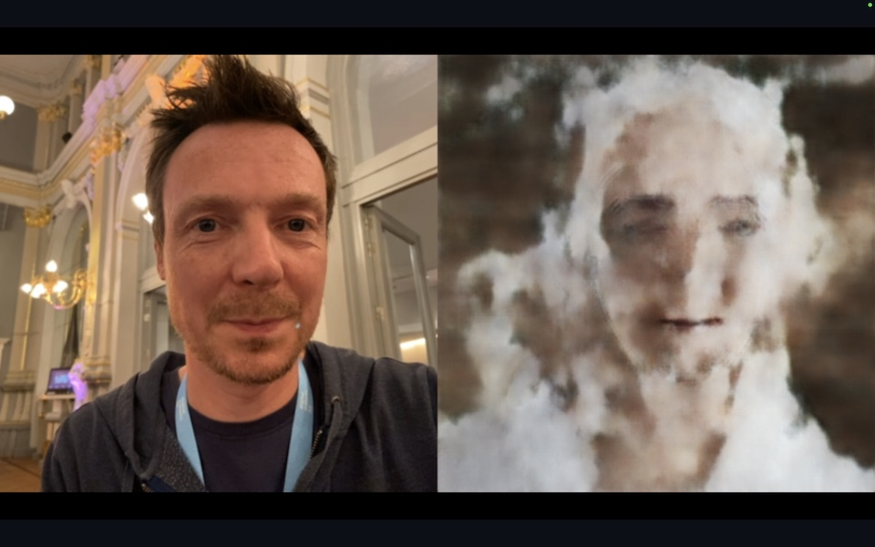

# Warsaw 2024 Creative AI Workshop

Creative AI Workshop organised by [The Algorithmic Gaze](https://algorithmicgaze.com/).

# Figment

Download the [latest version of Figment](https://figmentapp.com/download/).

Build a simple hand/face segmentation pipeline using the webcam.

[Example Figment File](figment/face_segmentation_webcam.fgmt)

Save all output files as `.jpg` files in a directory; then create a ZIP file of the directory (On Mac: Right-Click > Compress)

# Training on Colab

The `pix2pix_training/pix2pix_train_colab.ipynb` script is set up to run in [Google Colab](https://colab.research.google.com/):

**[Open training notebook in Google Colab](https://colab.research.google.com/github/algorithmicgaze/2024-warsaw-workshop/blob/main/training_colab/pix2pix_train_colab.ipynb)**

1. Go to [Google Colab](https://colab.research.google.com/)
2. Choose the GitHub tab and type `https://github.com/algorithmicgaze/2024-warsaw-workshop`
3. Choose the pix2pix_train_colab.ipynb script.
4. Run the first cell. You'll get a warning that the notebook was not authored by Google. Click "Run Anyway".
5. Open the "Files" sidebar (click the icon on the left) and drag your ZIP file in the panel.
6. Run all other cells, except for the cell marked as optional (the one that says "curl").
7. After the training has completed, you will see a generator.zip file in the `output` folder. Click the three dots to download that file, or use the optional steps to copy to Google Drive

If you have [Colab Pro](https://colab.research.google.com/signup/pricing), the script will execute substantially faster.

## Converting to TensorFlow.js

To run the model in realtime in Figment, you'll need to convert it to TensorFlow.js. You can use the following script to do that:

**[Open conversion notebook in Google Colab](https://colab.research.google.com/github/algorithmicgaze/2024-warsaw-workshop/blob/main/training_colab/pix2pix_convert_to_tfjs.ipynb)**

1. Upload the generator.zip file you downloaded from the last step, or connect the notebook to Google Drive.
2. Run all cells to do the conversion.
3. The last cell will download a `tfjs.zip` file. Put that in your Figment project folder.

# Inference

Once the model has trained, you should be able to convert it to TensorFlow.js by running the last cells of the script.

If you don't have a model yet, you can download a complete prepared model from this link:

[unsplash_woman_tfjs.zip](https://enigmeta.s3.amazonaws.com/2022-kikk-workshop/unsplash_woman_tfjs.zip)

Unzip the file in the `figment/assets` folder. So there should be a folder `figment/assets/unsplash_woman_tfjs`.

Open the [`face_inference.fgmt`](figment/face_inference.fgmt) script in the `figment` folder with Figment. You should be able to control the face with your webcam!

[Example Figment File](figment/face_inference.fgmt)

# Next Steps

Once the model is trained, try feeding in different things than a face. What happens if the lines are hands? Or shapes? Can you scan a drawing with your webcam and control the face that way?

There are some quality improvements you can do too:

- Training for longer can help a lot
- Curating the dataset better might produce better results

